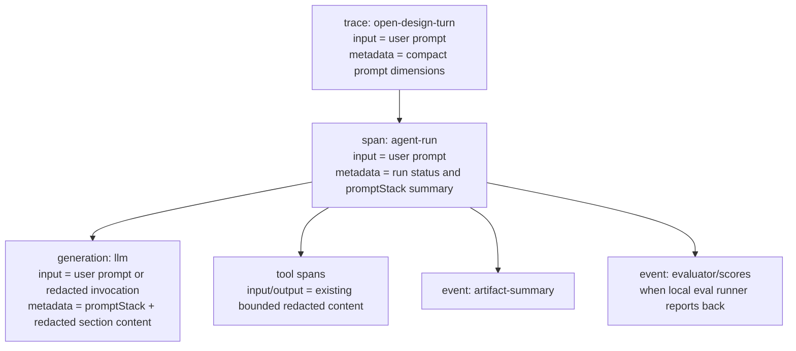

# Langfuse Prompt Stack Observability

## Purpose

Open Design uses Langfuse to understand agent runs, costs, outputs, feedback,
and failure patterns. Today the Langfuse trace input intentionally shows only
the user's current prompt. That keeps the session UI readable, but it hides the
actual prompt stack sent to local agent CLIs: daemon system instructions,
discovery rules, active skills, design-system content, runtime tool guidance,
form-answer overrides, cwd hints, and attachments.

This spec defines how Open Design should add prompt-stack diagnostics to
Langfuse without turning traces into an unsafe dump of private prompts, tool
tokens, local paths, or attachment content.

The target outcome is a trace that can answer:

- What user request triggered this run?
- What exact instruction/system sections were composed for the model, after
  redaction and within bounded capture limits?
- Which prompt sections and runtime flags were active?
- Which skill, design system, plugin stage, model, release, and prompt-stack
  fingerprint produced the output?
- Did discovery ask a form, skip a form, or suppress a repeated form?
- Which production traces should become eval dataset items?
- Which automated or human scores explain regressions over time?

The primary product goal for v1 is fast prompt-behavior debugging from a
Langfuse trace. Evaluation aggregation is still important, but metadata alone
is not enough for the first debugging target. A reviewer should be able to open
the generation observation and inspect the redacted instruction stack that the
daemon actually sent to the agent.

## Current Behavior

The daemon currently treats Langfuse `input` as the user-facing prompt:

- `apps/daemon/src/server.ts:2502` returns `currentPrompt` or `message` through
  `telemetryPromptFromRunRequest`.
- `apps/daemon/src/langfuse-bridge.ts:343` redacts `run.userPrompt` and sends it
  as `ctx.message.prompt`.
- `apps/daemon/src/langfuse-trace.ts:363`, `:379`, and `:408` use that prompt as
  the trace, span, and generation input.

The actual agent prompt is assembled later:

- `apps/daemon/src/server.ts:10923` composes the daemon system prompt.
- `apps/daemon/src/server.ts:11023` adds research/run-context/client prompt
  material.
- `apps/daemon/src/server.ts:11036` joins daemon system, runtime tool, and
  client system sections.
- `apps/daemon/src/server.ts:11051` detects submitted form answers and injects
  the form-answer override.
- `apps/daemon/src/server.ts:11068` builds `composed`, the final prompt written
  to the agent adapter.

Because Langfuse receives only the user prompt, a trace can show that a run used
33k input tokens while its visible input looks like a short user request. That
gap is expected from the current implementation, but it is a poor debugging and
evaluation surface.

## Langfuse-Aligned Practices

This design follows these Langfuse practices from the official documentation:

- Treat a trace as one application request and use observations for individual
  steps such as generations, tools, evaluators, retrievers, and guardrails.
  Langfuse's tracing data model is increasingly observation-centric, so LLM
  invocation details belong on the generation observation rather than only on
  the trace top level.
- Use generation observations for LLM calls, including prompt/message input,
  model, token usage, cost, output, and generation metadata.
- Use metadata, tags, release, version, user, and session identifiers to slice
  metrics by application feature, runtime, prompt version, model, user, and
  release.
- Link prompts to traces/generations so Langfuse can aggregate metrics and
  scores per prompt version. Open Design's prompt stack is code-composed rather
  than centrally fetched from Langfuse, so this spec uses stable local hashes
  first and leaves first-class Langfuse prompt objects as a later migration.
- Use scores as the universal evaluation result object. Scores may come from
  code evaluators, LLM-as-judge, human annotation, user feedback, or custom
  SDK/API pipelines.
- Use datasets and experiments to replay fixed cases before deployment, and use
  online evaluation to score production traces continuously.

References:

- https://langfuse.com/docs/tracing-data-model
- https://langfuse.com/docs/observability/features/observation-types
- https://langfuse.com/docs/tracing-features/metadata
- https://langfuse.com/docs/prompt-management/features/link-to-traces
- https://langfuse.com/docs/prompt-management/features/prompt-version-control
- https://langfuse.com/docs/evaluation/core-concepts
- https://langfuse.com/docs/metrics/overview

## Non-Goals

This spec does not:

- Move Open Design system prompts into Langfuse Prompt Management.
- Require network prompt fetching before agent spawn.
- Replace trace input with the full composed prompt.
- Upload raw, unredacted system or composed prompt content.
- Upload raw tool tokens, API keys, local auth material, OAuth tokens, or MCP
  bearer tokens.
- Upload raw attachment contents by default.
- Treat Langfuse as the only visual-quality evaluator. Langfuse stores traces,
  datasets, experiments, scores, and dashboards; Open Design still needs local
  deterministic checks, screenshot inspection, LLM judges, and human review.

## Data Model

### Trace Input

Keep top-level `trace.input` as the user prompt.

Rationale:

- Session browsing remains readable.
- Existing tests and user workflows keep their current behavior.
- Trace-level input remains the business request, while generation metadata
  explains the exact prompt stack and LLM invocation.

### Generation Input

Open Design should make generation-level LLM invocation visibility useful for
debugging in the first implementation phase.

The baseline keeps `trace.input` readable as the user prompt. The generation
observation then keeps `generation.input` as the user prompt for Phase 1 and
gets both metadata and a bounded redacted representation of the allowed prompt
sections in the order they were composed.

```json
{
  "format": "open-design-composed-prompt",
  "streamFormat": "stream-json",
  "userPrompt": "redacted current user prompt",
  "promptStackHash": "sha256:...",
  "sections": [
    {
      "name": "formOverride",
      "present": true,
      "bytes": 1840,
      "sha256": "sha256:...",
      "redactedContent": "## OVERRIDE ...",
      "truncated": false
    },
    {
      "name": "daemonSystemPrompt",
      "present": true,
      "bytes": 24120,
      "sha256": "sha256:...",
      "redactedContent": "bounded redacted system prompt content",
      "truncated": true
    }
  ],
  "composedPromptPreview": "not emitted in Phase 1"
}
```

Section capture is bounded and gated by the existing conversation/tool content
telemetry consent, but it is not postponed to a later evaluation phase. Without
section content, Langfuse can identify the prompt stack hash that failed but
cannot explain which instruction caused the behavior.

### Prompt Stack Metadata

Add a `promptStack` object to trace metadata and generation metadata. The trace
copy is compact for dashboards; the generation copy may include bounded preview
fields when content capture is enabled.

```ts
interface PromptStackTelemetry {
  schemaVersion: 1;
  userPrompt: {
    bytes: number;
    sha256: string;
    truncated: boolean;
  };
  composedPrompt: {
    bytes: number;
    sha256: string;
    redactedPreview?: string;
    redactedPreviewBytes?: number;
    redactedPreviewTruncated?: boolean;
    redactedContent?: string;
    redactedContentBytes?: number;
    redactedContentTruncated?: boolean;
  };
  daemonSystemPrompt: {
    bytes: number;
    sha256: string;
  };
  sections: PromptSectionTelemetry[];
  flags: PromptStackFlags;
  routing: PromptRoutingTelemetry;
  privacy: PromptPrivacyTelemetry;
}

interface PromptSectionTelemetry {
  name:
    | 'formOverride'
    | 'daemonSystemPrompt'
    | 'runtimeToolPrompt'
    | 'researchCommandContract'
    | 'runContextPrompt'
    | 'clientSystemPrompt'
    | 'cwdHint'
    | 'linkedDirsHint'
    | 'echoGuard'
    | 'userRequest'
    | 'attachments'
    | 'commentAttachments'
    | 'promptImagePaths';
  present: boolean;
  bytes: number;
  sha256?: string;
  redactionApplied?: boolean;
  redactedContent?: string;
  redactedContentBytes?: number;
  redactedContentTruncated?: boolean;
}

interface PromptStackFlags {
  streamFormat: 'text' | 'stream-json';
  resumesSessionViaCli: boolean;
  skipDiscoveryBrief: boolean;
  formAnswersDetected: boolean;
  formOverrideKind: 'none' | 'discovery' | 'task-type' | 'generic';
  mediaSurface: boolean;
  mediaExecutionKind?: string;
  critiqueEligible: boolean;
  connectedExternalMcpCount: number;
  promptImagePathCount: number;
  attachmentCount: number;
  commentAttachmentCount: number;
}

interface PromptRoutingTelemetry {
  agentId?: string;
  model?: string;
  reasoning?: string;
  skillId?: string;
  skillIds?: string[];
  activeSkillDirCount: number;
  designSystemId?: string;
  designSystemTitle?: string;
  appliedPluginSnapshotId?: string;
  pluginTrust?: 'restricted' | 'trusted';
  activeStageCount: number;
}

interface PromptPrivacyTelemetry {
  contentCapture:
    | 'off'
    | 'redacted-section-content'
    | 'redacted-composed-content'
    | 'redacted-generation-input';
  redactionVersion: string;
  maxSectionBytes: number;
  maxComposedBytes: number;
  localPaths: 'redacted' | 'hashed' | 'omitted';
  attachments: 'metadata-only' | 'redacted-preview';
  toolTokens: 'omitted';
}
```

Capture modes:

- `off`: hashes, bytes, section presence, routing, and flags only.
- `redacted-section-content`: include bounded redacted content for instruction
  sections. This is the Phase 1 target because it shows the system prompt stack
  without uploading attachment bodies.
- `redacted-composed-content`: include a bounded redacted final composed prompt
  preview in addition to section content.
- `redacted-generation-input`: set generation input to the structured redacted
  invocation object. This is the most Langfuse-native debug view and should
  remain opt-in until reviewed.

### Flat Metadata for Metrics

Langfuse metadata can store JSON, but dashboard filters and propagated metadata
work best with shallow stable dimensions. Alongside nested `promptStack`, add
compact top-level metadata keys:

```json
{
  "promptStackSchemaVersion": 1,
  "promptStackHash": "sha256:...",
  "promptStackBytes": 32768,
  "daemonSystemPromptHash": "sha256:...",
  "promptDiscoveryState": "turn1-discovery",
  "promptFormOverride": "none",
  "promptMediaSurface": false,
  "promptContentCapture": "redacted-section-content",
  "skillId": "landing-page",
  "designSystemId": "acme",
  "agent": "claude",
  "model": "claude-sonnet-4-6",
  "appVersion": "..."
}
```

Recommended `promptDiscoveryState` values:

- `turn1-discovery`
- `default-router-task-type`
- `skipped-by-user`
- `skipped-by-metadata`
- `form-answers-discovery`
- `form-answers-task-type`
- `form-answers-generic`
- `media-contract`
- `not-applicable`

## Privacy and Safety

Prompt observability must be safe by default.

Rules:

- Hash raw prompt strings before redaction so equality/regression analysis works
  without relying on content. Use SHA-256 with a `sha256:` prefix.
- Report byte counts for raw strings.
- Run lexical secret redaction before any preview enters Langfuse.
- Omit tool tokens entirely. Do not rely on redaction for tool token safety.
- Treat `runtimeToolPrompt`, cwd hints, linked dirs, MCP config, OAuth-derived
  context, attachments, and image paths as sensitive.
- Redact local paths to `[REDACTED_PATH]` by default. A path like
  `/Users/<name>/Documents/...` can identify a person or repo; preserving only
  the basename can still leak project, customer, or user names.
- Report attachment counts, file extensions, size buckets, and hashes before
  reporting any attachment text.
- Bound captured content. Phase 1 captures up to 16 KiB per redacted
  instruction section and up to 64 KiB total across all redacted section
  content for one run. Record bytes and truncation state when either bound is
  hit.
- Never emit prompt previews when Langfuse content capture is disabled.
- Add tests with fake API keys, bearer tokens, OD tool tokens, emails, local
  paths, and attachment names to prove previews are redacted.
- Prefer section-level content over final composed content for the default
  debug view. Section boundaries make prompt-order and prompt-conflict issues
  easier to inspect, and they reduce accidental capture of user attachments.
- Do not upload raw attachment bodies, raw comment attachment bodies, or raw
  prompt image paths in Phase 1.

## Trace Shape

Recommended observation tree:



Generation metadata should include the richest prompt diagnostics because it is
the object closest to the LLM call. For prompt debugging, the generation view
must show redacted section content when capture is enabled. Trace metadata
should include only fields needed for browsing, filtering, and dashboards.

## Evaluation Loop

Langfuse is the right registry and analysis surface for Open Design effect
evaluation, but it is not the whole evaluator.

Use Langfuse for:

- Trace collection and session browsing.
- Prompt-stack, runtime, release, model, skill, and design-system dimensions.
- Datasets created from production/staging traces.
- Experiments comparing prompt-stack hashes, releases, models, and skills.
- Scores from user feedback, human annotation, code checks, LLM-as-judge, and
  local visual-quality pipelines.
- Dashboards for score, cost, latency, token, and failure trends.

Use Open Design local/CI runners for:

- Deterministic artifact checks: file created, valid HTML, no duplicate form,
  no empty artifact, expected asset references, basic accessibility checks.
- Browser checks: Playwright screenshot, responsive layouts, console errors,
  nonblank canvas/media, image load success.
- Domain-specific visual scoring: design-system adherence, content specificity,
  mobile/desktop polish, no text overlap, no broken controls.
- Golden dataset replay against the daemon using mock CLIs where possible.

Initial score names:

```text
artifact_created          BOOLEAN
valid_html                BOOLEAN
no_repeat_form            BOOLEAN
responsive_ok             BOOLEAN
asset_load_ok             BOOLEAN
visual_quality            NUMERIC 0..1
design_system_adherence   NUMERIC 0..1
content_specificity       NUMERIC 0..1
overall_quality           NUMERIC 0..1
failure_reason            CATEGORICAL
review_notes              TEXT
```

Each score should include metadata linking it to:

- `traceId`
- `runId`
- `assistantMessageId`
- `promptStackHash`
- `appVersion`
- `agent`
- `model`
- `skillId`
- `designSystemId`
- evaluator name/version

## Implementation Plan

### Phase 1: Debug-Ready Prompt Diagnostics

Phase 1 is one implementation issue under the #3496 umbrella. It should land
debug-ready prompt-stack observability without introducing a new user-facing
privacy toggle.

Phase 1 capture target:

- Keep top-level `trace.input` as the user prompt.
- Keep `generation.input` as the user prompt.
- Emit `promptStack` on trace and generation metadata.
- Use `redacted-section-content` as the Phase 1 capture mode whenever existing
  Langfuse delivery is eligible: `telemetry.metrics === true`,
  `telemetry.content === true`, and a Langfuse sink is configured.
- Reuse the existing Settings -> Privacy "Conversation and tool content" consent
  gate. Do not add a prompt-stack-specific UI toggle or environment override in
  Phase 1.
- Use plain SHA-256 with a `sha256:` prefix for prompt, section, and stack
  fingerprints.
- Capture up to 16 KiB per allowed redacted instruction section and up to 64
  KiB total redacted section content per run.
- Replace local paths with `[REDACTED_PATH]`.
- Verify whether completed Langfuse generations already include bounded
  redacted assistant output. If output is missing, Phase 1 should add bounded
  redacted assistant output capture so prompt behavior can be inspected against
  the model result.

Phase 1 section-content allowlist:

- May include bounded `redactedContent`: `formOverride`,
  `daemonSystemPrompt`, `runtimeToolPrompt`, `researchCommandContract`,
  `runContextPrompt`, `clientSystemPrompt`, `echoGuard`, `userRequest`, and
  implementation-specific skill, design-system, plugin, or stage prompt
  sections when they can be separated from raw attachments.
- Metadata-only in Phase 1: `cwdHint`, `linkedDirsHint`, `attachments`,
  `commentAttachments`, and `promptImagePaths`. Report presence, counts, file
  extensions, size buckets, hashes, and truncation state where available, but do
  not upload raw path strings or attachment bodies.

Out of scope for Phase 1:

- raw or unredacted prompt capture;
- redacted final composed prompt preview;
- structured `generation.input`;
- Langfuse Prompt Management migration;
- dataset, experiment, and score-writing implementation.

Add a daemon-local prompt telemetry builder after `composed` is built and before
the agent is spawned.

Suggested modules:

- `apps/daemon/src/prompt-telemetry.ts`
- `apps/daemon/tests/prompt-telemetry.test.ts`

The builder accepts raw prompt sections, routing context, and run flags. It
returns:

- nested `promptStack` diagnostics;
- flat metric dimensions;
- redaction status;
- bounded redacted section content for allowed instruction sections.

Store the result on the in-memory run record and thread it through:

- `apps/daemon/src/server.ts`
- `apps/daemon/src/langfuse-bridge.ts`
- `apps/daemon/src/langfuse-trace.ts`

Do not change top-level `trace.input` in this phase. Generation metadata should
be sufficient to debug prompt behavior from the Langfuse UI.

### Phase 2: Structured Generation Input

Promote the redacted prompt invocation from generation metadata into
`generation.input` for users who want the Langfuse generation panel to show the
LLM call in a first-class way.

The structured input should contain the same section array, hashes, byte counts,
and capture flags from Phase 1. It should not include raw unredacted prompt
content.

This may be configured through existing Langfuse telemetry config or a new
daemon setting. Product/security review should decide whether and when the
structured generation input view is worth the higher UI/semantics risk. It is
not required for prompt-stack debugging in Phase 1.

### Phase 3: Evaluation Dataset and Scores

Add an eval runner that can:

- select traces by metadata filters;
- replay or inspect artifacts;
- run deterministic/browser/LLM-judge checks;
- write scores back to Langfuse;
- create or update Langfuse dataset items for regression suites.

This phase can start independently once Phase 1 adds enough prompt dimensions
to filter and group traces.

### Phase 4: Prompt Version Registry

Consider whether stable Open Design prompt layers should become Langfuse prompt
objects:

- daemon base system prompt;
- discovery prompt;
- media contract;
- design-system usage wrapper;
- AskUserQuestion guidance.

This is a later migration because Open Design currently composes prompts from
code, local files, project metadata, plugin snapshots, and runtime state. The
first requirement is observability of the local prompt stack, not remote prompt
management.

## Testing Strategy

Phase 1 tests:

- Unit-test prompt telemetry hashing, byte counts, section presence, and flat
  dimensions.
- Unit-test redaction with fake credentials, bearer tokens, OD tool tokens,
  emails, local paths, linked dirs, and attachment names.
- Unit-test bounded redacted section capture for daemon system prompt,
  form-answer override, runtime tool prompt, client system prompt, skill,
  design-system, plugin/stage prompt sections, and user request.
- Unit-test metadata-only capture for cwd hints, linked dirs, attachments,
  comment attachments, and prompt image paths.
- Unit-test 16 KiB per-section and 64 KiB total redacted section content limits,
  including byte counts and truncation flags.
- Bridge tests assert `promptStack` appears in Langfuse trace and generation
  metadata.
- Bridge tests assert redacted section content follows the existing
  `telemetry.metrics && telemetry.content` Langfuse delivery gate.
- Bridge tests assert local paths are replaced with `[REDACTED_PATH]` and raw
  attachment bodies are not uploaded.
- Existing tests continue to assert top-level `trace.input` is the user prompt.
- Existing tests continue to assert `generation.input` is the user prompt.
- Bridge tests verify completed generations include bounded redacted assistant
  output, or explicitly document that existing output capture already satisfies
  this requirement.
- Chat-route tests cover discovery, skip-discovery, form-answer overrides,
  media surfaces, active skill, active design system, and plugin snapshot
  dimensions.

Phase 2 tests:

- Verify structured generation input is emitted only in explicit opt-in mode.
- Verify structured generation input contains no raw tokens, credentials, local
  user paths, or attachment bodies.

Phase 3 tests:

- Eval runner can score a fixture trace/artifact and post Langfuse scores.
- Dataset creation preserves trace/run/prompt-stack linkage.
- Score names and data types remain stable.

## Open Questions

- Should a future Phase 2/3 introduce a narrower prompt-stack capture control
  after Phase 1 proves the existing content consent model is too coarse?
- Should a future privacy hardening pass move from plain SHA-256 to
  installation-scoped HMAC-SHA-256 if cross-install prompt correlation becomes
  a concern?
- What is the right threshold for shrinking the 16 KiB / 64 KiB bounds if
  Langfuse metadata payload size affects ingestion reliability?
- Which traces should be sampled into human annotation queues first: failures,
  low user feedback, high token cost, or new prompt-stack hashes?
